# FastRelax (ProteinMPNN & AF2 Predeiction)

**FastRelax**는 David Baker Lab에서 개발된 단백질 작용기를 디자인하기위한 알고리즘으로써 **ProteinMPNN**을 활용하기 때문에 동일한 기능을 수행하지만, **AlphaFold2**를 통한 구조예측 과정을 포함하는 알고리즘이며, **RFdiffusion** 알고리즘을 검증하기 위해 Binder 디자인 시 활용한 알고리즘입니다.

**ProteinMPNN** 알고리즘과 달리 **PyRosetta** 패키지를 필요로하며, **ProteinMPNN** 알고리즘을 사용할 때는 CPU만을 활용하고,  **AlphaFold2**를 통한 구조예측 과정에서는 GPU를 활용합니다.
(**FastRelax**는 **ProteinMPNN**의 경량화된 알고리즘이기 때문에, CPU만을 활용하도록 설계되어 있습니다.)

**ProteinMPNN** 알고리즘을 활용할때는 Pytorch를, **AlphaFold2**를 통한 구조예측 시에는 Tensorflow를 활용하지만 Pytorch는 CPU만을 활용하기 때문에 GPU를 활용하는 Tensorflow 버전으로 설치해야하며, Tensorflow 버전과 호환되는 CUDA, cuDNN 버전을 셋팅해야합니다.


## Anaconda 설치
### 1. 아래 링크를 통해 아나콘다 다운로드 페이지로 이동

> 링크 : [Anaconda Homepage Link](https://www.anaconda.com/download/success)


### 2. Linux에서 64-Bit (X86) Installer 의 링크 복사


### 3. 아래 코드를 이용하여 2번에서 복사한 다운로드 링크를 이용하여 아나콘다 설치파일을 다운로드

> CODE: **`wget https://repo.anaconda.com/archive/Anaconda3-2024.06-1-Linux-x86_64.sh`**

위 코드는 예시이며, **`https://repo.anaconda.com/archive/Anaconda3-2024.06-1-Linux-x86_64.sh`** 부분에 2번에서 복사한 다운로드 링크를 붙여넣기로 입력합니다.

### 4. 아래 코드를 이용해서 3번에서 다운받은 아나콘다 설치 파일을 실행하여 아나콘다 설치
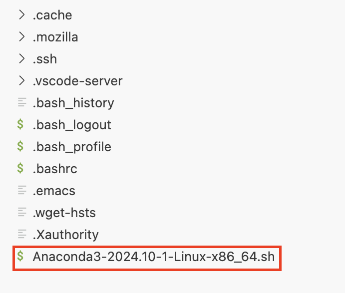

> CODE: **`sh Anaconda3-2024.06-1-Linux-x86_64.sh`**

위 코드는 예시이며, **`Anaconda3-2024.06-1-Linux-x86_64.sh`** 에 3번을 통해 다운받은 설치파일(sh 파일)을 입력합니다.

설치가 완료되면 다음과 같이 `anaconda3` 이라는 폴더가 생성됩니다.


### 5. 아래 코드를 이용해서 설치된 아나콘다 환경을 적용시켜줍니다.

> CODE: **`source ~/.bashrc`**

아나콘다 환경이 적용되면 아래 그림과 같이 CODE 줄 좌측의 계정명 앞에 `(base)`라는 표시가 새롭게 추가됩니다.

  


## Pyrosseta 설치

**FastRelax**를 활용하기 위한 환경 셋팅 과정에서 자동적으로 **Pyrosetta**를 자동적으로 설치합니다.

하지만 **Pyrosetta**를 별도로 활용하고자 한다면 아래와 같이 설치하여 사용할 수 있습니다.
(**Python**에 설치할 수도 있지만, 버전 간 충돌 및 작업 별 환경을 분리하기 위해 여기서는 **Conda**를 통해 설치합니다.)

> CODE: **`conda create -n pyrosetta python==3.10 ipython`**  
> CODE: **`conda activate pyrosetta`**  
> CODE: **`conda env list`**

위 코드를 통해 **pyrosetta**라는 이름의 가상환경을 생성한 후, **python 3.10** 버전과 **ipython**을 설치해줍니다.

그리고 가상환경 목록을 확인하면 다음과 같이 **pyrosetta** 가상환경이 생성되어 있음을 확인할 수 있습니다.


이후, 아래 코드를 실행하여 **Pyrosetta**를 설치하고, 정상적으로설치되었는지 확인 해줍니다.

> CODE: **`conda install pyrosetta -c https://conda.graylab.jhu.edu`**  
> CODE: **`conda list | grep pyrosetta`**  

위 코드를 통해 아래 그림과 같이 **Pyrosetta**가 정상적으로 설치됨을 확인할 수 있습니다.

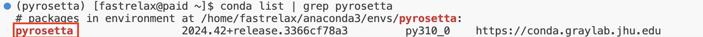


## Pyrosetta Lisence 추가

**Pyrosetta**를 활용하기 위해서는 반드시 Lisence를 추가해주어야 합니다.  
아래 코드를 실행하여 Lisence 추가 해줍니다.

> CODE: **`vi ~/.condarc`**

위 코드를 실행하면 `.condarc` 파일을 열 수 있습니다.  
`.condarc` 파일을 실행해보면, 아래 그림과 같이 아무것도 없는 빈 파일이 나타납니다.  


아래 코드를 실행하여 `.condarc` 파일에서 편집 모드로 전환하고, Lisence를 추가해줍니다.

> CODE: **`ESC` 입력 후 `i` 입력**

위 코드를 통해 편집 모드로 전환되면 아래 그림과 같이 좌측 하단에 **--INSERT--** 라고 표시됩니다.  
**--INSERT--** 라고 표시되어야 내용을 입력할 수 있습니다.


아래 내용을 복사하여 `.condarc` 파일에 추가 해줍니다.  

> CODE: 
```
# ----- Pyrosetta Lisence----------------------------------------------------------------------------------
channels:
- https://conda.graylab.jhu.edu
# some of PyRosetta versions might require conda-forge channel, uncomment line below if you want to use it
- conda-forge
- defaults
# ---------------------------------------------------------------------------------------------------------
```  

> CODE: **`ESC` 입력 후 `wq` 입력 후 `Enter`**

위 코드와 같이 Lisence를 추가해주고, 입력한 내용을 저장하는 코드(2번째 코드)를 입력해주면, 입력한 Lisence가 저장됩니다.

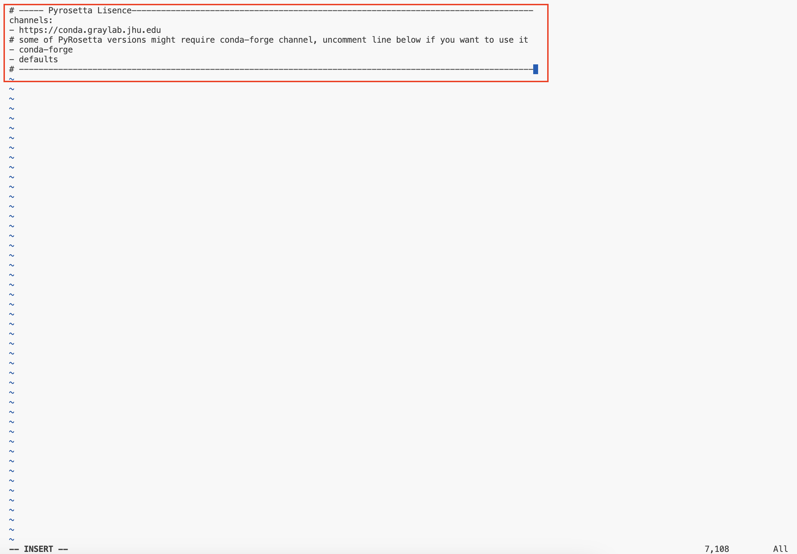  
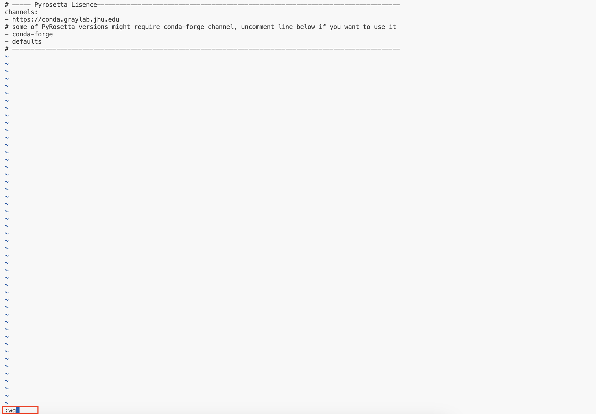

다음으로 **FastRelax** 설치를 위해 아래 코드를 실행하여 Conda 가상환경을 종료해 줍니다.

> CODE: **`conda deactivate`**  


## FastRelax를 위한 가상환경 셋팅

### FastRelax Github 공식 링크: [FastRelax Gthub Link](https://github.com/nrbennet/dl_binder_design.git)  

앞에서 **FastRelax**는 **ProteinMPNN**을 활용한 작용기 디자인과 **AlphaFold2**를 활용한 구조예측, 두 기능을 수행할 수 있습니다.

각 작업을 실행하기 위해 별도의 가상환경을 셋팅을 필요로하는데, 작용기 디자인을 위한 **proteinmpnn_fastrelax**라는 가상환경과, 구조예측을 위한 **af2_binder_design**라는 가상환경을 셋팅합니다.

## 작용기 디자인을 위한 proteinmpnn_fastrelax 가상환경 셋팅

먼저 아래 코드를 실행하여 **FastRelax** Github의 Repository를 복제합니다.

> CODE: **`git clone https://github.com/nrbennet/dl_binder_design.git`**  

위 코드를 실행하면 아래 그림과 같이 **dl_binder_design**라는 폴더가 생성됩니다.

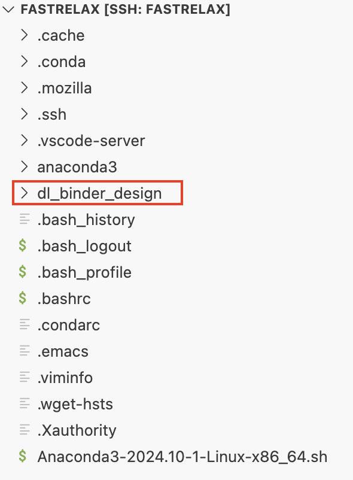  

그리고 아래 코드를 실행하여 **dl_binder_design** 폴더 안에 있는 **include** 폴더로 이동하고, **proteinmpnn_fastrelax** 가상환경을 설치 해줍니다.

> CODE: **`cd ~/dl_binder_design/include`**  
> CODE: **`conda env create -f proteinmpnn_fastrelax.yml`**  
> CODE: **`conda env list`**

위 코드를 실행하면 아래 그림과 같이 **proteinmpnn_fastrelax**라는 가상환경이 생긴것을 확인할 수 있습니다.

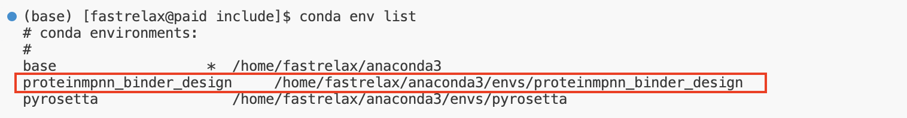  

아래 코드를 통해 설치한 가상환경을 실행하고, 정상적으로 설치되었는지 확인해줍니다.  

> CODE: **`conda activate proteinmpnn_binder_design`**  
> CODE: **`python ~/dl_binder_design/include/importtests/proteinmpnn_importtest.py`**


위 코드를 실행하면 아래 그림과 같이, **Pyrosetta**는 실행되나 Pytorch를 불러올 수 없다는 에러 메세지를 확인할 수 있습니다.  
이는 알고리즘을 실행하기위한 Pytorch 버전이 호환되지 않기 때문에 발생하는 것입니다.  

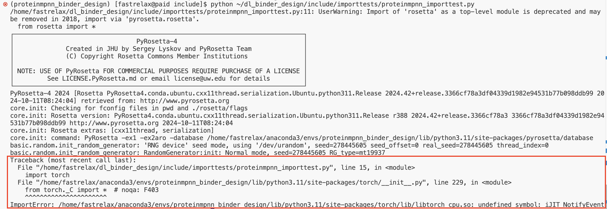  

아래 코드를 통해 가상환경 셋팅 과정에서 설치된 Pytorch의 정보를 확인해보면, **FastRelax**는 작용기 디자인 시, GPU를 사용하지 않고, CPU를 사용한다고 했지만, GPU를 사용하는 Pytorch가 설치된 것을 확인할 수 있습니다.

> CODE: **`conda list | grep pytorch`**

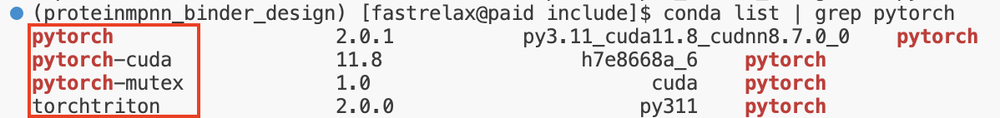  

따라서, 기존에 설치되어 있는 Pytorch를 삭제 후 CPU를 사용하는 Pytorch 버전으로 재설치 해줍니다.

> CODE: **`conda uninstall pytorch`**
> CODE: **`conda list | grep pytorch`**

위 코드를 실행하여 설치되어 있는 Pytorch를 삭제하고, 다시 설치여부를 확인했을 때, 아무것도 출력되지 않아야 합니다.  

### Pytorch 공식 링크: [Pytorch Homepage Link](https://pytorch.org/)  

아래 그림과 같이 Pytorch 홈페이지로 이동하여, Pytorch CPU 버전 설치를 위한 환경을 선택해주고, 설치 코드를 복사합니다.

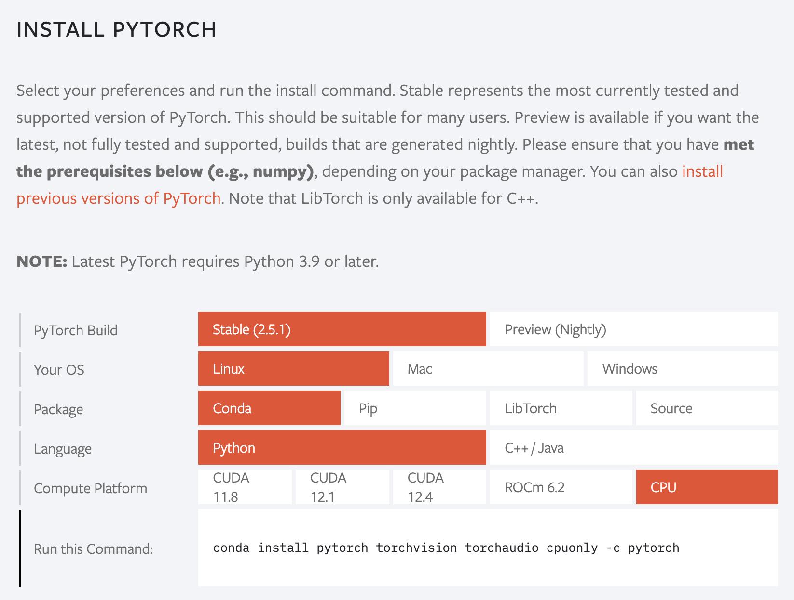

복사한 설치코드 (아래 코드)를 통해 Pytorch CPU 버전을 설치 해줍니다.  

> CODE: **`conda install pytorch torchvision torchaudio cpuonly -c pytorch`**  
> CODE: **`conda list | grep pytorch`**  

위 코드를 통해 Pytorch CPU 버전을 설치하고, 확인해보면 아래 그림과 같이 정상적으로 설치된 것을 확인할 수 있습니다.

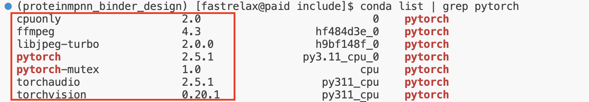  

다시 아래 코드를 통해 **proteinmpnn_fastrelax**라는 가상환경이 잘 설치되었는지 작동여부를 확인합니다.

> CODE: **`python ~/dl_binder_design/include/importtests/proteinmpnn_importtest.py`**  

이제 아래 그림과 같이 정상적으로 작동하는 것을 확인할 수 있습니다.

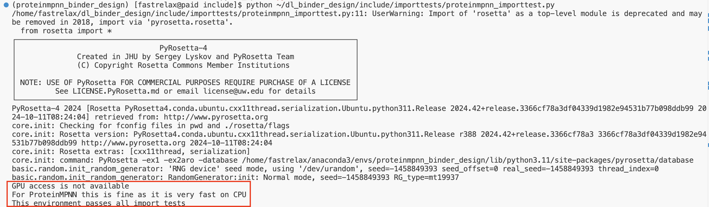  

## 구조예측을 위한 af2_binder_design 가상환경 셋팅

이제 구조예측을 위한 **af2_binder_design** 가상환경을 셋팅하기 위해 아래 코드를 통 앞서 활성화한 **proteinmpnn_fastrelax** 가상환경을 종료하고, ROOT 디렉토리로 이동합니다.

> CODE: **`conda deactivate`**  
> CODE: **`cd ~`**  

그리고 아래 코드를 이용하여 **af2_binder_design** 가상환경을 설치 해줍니다.

> CODE: **`cd ~/dl_binder_design/include`**  
> CODE: **`conda env create -f af2_binder_design.yml`**  
> CODE: **`conda env list`**  

위 코드를 실행하면 아래 그림과 같이 **af2_binder_design** 가상환경이 생성된 것을 확인할 수 있습니다.  

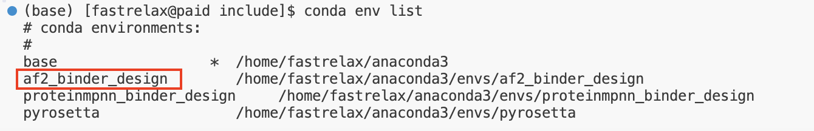  

아래 코드를 실행하여 설치된 **af2_binder_design** 가상환경을 실행하고, 정상적으로 작동하는지 확인합니다.

> CODE: **`conda activate af2_binder_design`**  
> CODE: **`python ~/dl_binder_design/include/importtests/af2_importtest.py`**  

위 코드를 실행하면 아래 그림과 같이 에러 메세지가 발생하는 것을 확인할 수 있습니다.  
이는 **af2_binder_design** 실행과정에서 Biopython 이라는 패키지의 1.81 version를 사용하는데, 1.84 version이 설치되어 호환되지 않기 때문에 발생하는 에러입니다.

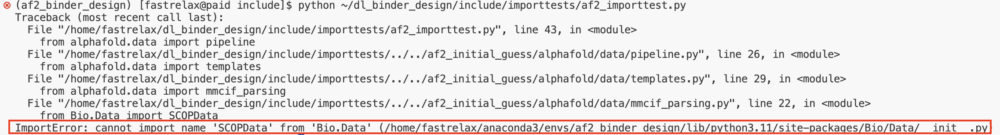  
  

따라서, 아래 코드를 통해 **af2_binder_design** 가상환경 설치과정에서 함께 설치된 Biopython를 확인하고, 삭제 후 재설치 해줍니다.

> CODE: **`conda list | grep biopython`**  
> CODE: **`conda uninstall biopython`**  
> CODE: **`conda list | grep biopython`**  
> CODE: **`conda install biopython==1.81`**  

  

다시 아래 코드를 통해 설치한 **af2_binder_design**가 정상적으로 작동하는지 확인합니다.  

> CODE: **`python ~/dl_binder_design/include/importtests/af2_importtest.py`**  

아래 그림과 같이 설치한 **af2_binder_design**가 정상적으로 작동하는 것을 확인할 수 있습니다. 하지만 표시된 부분과 같이 GPU를 활용하지 않는 것으로 나타납니다.  
이는 Tensorflow 버전이 GPU를 활용하기 위한 CUDA, cuDNN 버전과 호환되지 않기 때문입니다.  

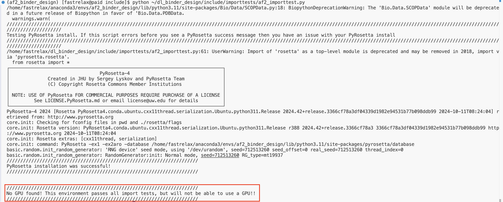  

여기에서는 **CUDA: 12.3**, **cuDNN: 8.9.7.29**, **Tensorflow: 텐서플로우-2.17.0**의 환경으로 작업을 수행합니다.  
**af2_binder_design**에서 GPU를 사용할 수 있도록 기존의 Tensorflow를 삭제 후, 설치된 CUDA, cuDNN 버전과 호환되는 GPU 버전의 Tensorflow를 재설치 해줍니다.

> CODE: **`conda list | grep tensorflow`**  

위 코드를 통해 먼저 설치되어 있는 Tensorflow를 확인해보면, 아래 그림과 같이 2.16.1 version이 설치됨을 확인할 수 있으며, GPU를 활용하는 Tensorflow가 아닌 CPU를 활용하는 Tensorflow임을 확인할 수 있습니다.  

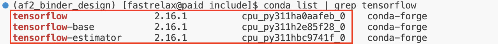  

> CODE: **`conda uninstall tensorflow`**  
> CODE: **`conda list | grep tensorflow`**  
> CODE: **`pip install tensorflow==2.17.0`**  
> CODE: **`conda list | grep tensorflow`**  

위 코드를 통해 기존 설치되어 있는 **Tensorflow**를 삭제하고, **2.17.00 version**으로 재설치합니다.  
재설치 후 설치된 **2.17.00 version**의 **Tensorflow**를 확인해보면 아래 그림에 표시된 것과 같이 나타납니다.  

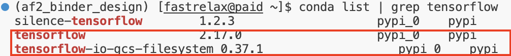


## FastRelax 모델을 실행하기 위한 Silent Tool 환경 셋팅

FastRelax는 작업 수행과정에서 **Silent Tool** 이라는 Third Party Source Code를 활용합니다.  
Silent Tool은 다량의 PDB 파일을 하나의 silent라는 확장자로 변환시키는 알고리즘이며, 이를 통하 다량의 디자인된 펩타이드를 한꺼번에 작업할 수 있도록 도와줍니다.  
SilentTool은 작용기 디자인를 위해 앞서 설치한 가상환경 **proteinmpnn_binder_design**과 **AlphaFold2**를 활용하여 디자인된 작용기의 구조를 예측하기 위한 가상환경 **af2_binder_design**에 모두 활용됩니다.

### Silent Tool Github 공식 링크: [Silent Tool Github](https://github.com/bcov77/silent_tools)

> CODE: **`conda deactivate`**  
> CODE: **`cd ~`**  
> CODE: **`mkdir software`**  
> CODE: **`cd software`**  
> CODE: **`git clone https://github.com/bcov77/silent_tools.git`**   

위 코드를 통해 Silent Tool 환경을 셋팅하기 위해 최상위 Root directory로 이동 후, `software`라는 폴더를 생성해 줍니다.  
생성한 `software` 폴더로 이동하여 Silent Tool의 공식 Github Repository를 복제합니다.  
Repository를 복제하면 아래 그림과 같이 Silent Tool의 Github에 있는 파일들이 복제됩니다.  

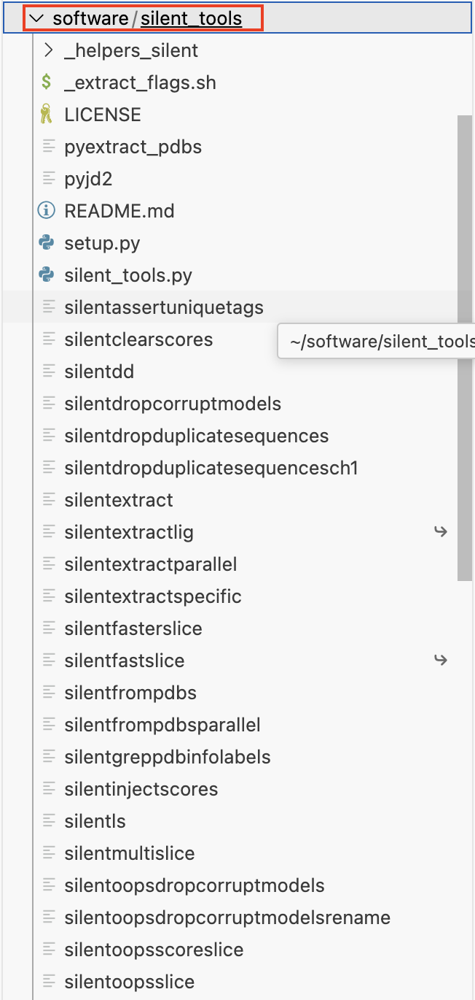  

> CODE: **`cd silent_tools`**  

위 코드를 실행하여, 복제한 Silent Tool Github Repository로 이동하기 위해 **silent Tool** 폴더로 이동합니다.  
**silent Tool** 폴더는 Silent Tool Github Repository가 저장되어 있는 폴더 입니다.  
**Silent Tool** 추가 환경셋팅 과정없이 Github Repository를 복제하는 것 만으로 사용이 가능합니다.  

> CODE: **`echo "PATH=\$PATH:$(pwd)"`**  

하지만 복제한 Silent Tool Github Repository를 서버 또는 개인 컴퓨터에서 활용하기 위해 결로를 설정해줘야하기 때문에 위 코드를 통해서 복제한 **Silent Tool**의 경로를 확인합니다.
경로를 확인하게 되면, 아래 그림의 표시된 부분과 같이 경로가 출력됩니다.  

  

> CODE: **`vi ~/.bashrc`**  
> CODE: **`ESC` 누른 후 `i` 입력**  
> CODE: **맨 아래로 이동하여 `PATH=$PATH:/home/fastrelax/software/silent_tools` 경로 입력**  
> CODE: **`ESC` 누른 후 `:` 입력하고, `wq` 입력 후 `Enter`**  
> CODE: **`source ~/.bashrc`**  

위 코드를 통해 아래 그림과 같이 `.bashrc` 라는 시스템 설정 파일을 열고, 편집 모드로 전환하여 출력된 경로는 추가해 줍니다.  
출력 경로를 추가하게 되면 시스템 환경에서 해당 경로를 기본적으로 적용하게 됩니다.  

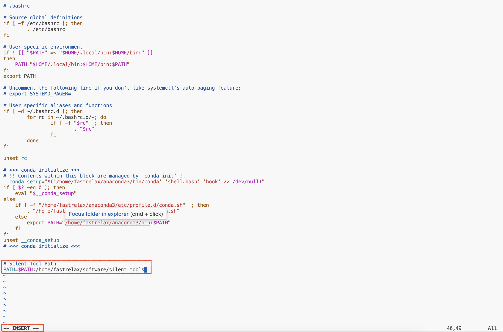  

<br>
<br>
<br>

# ___ END
