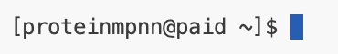
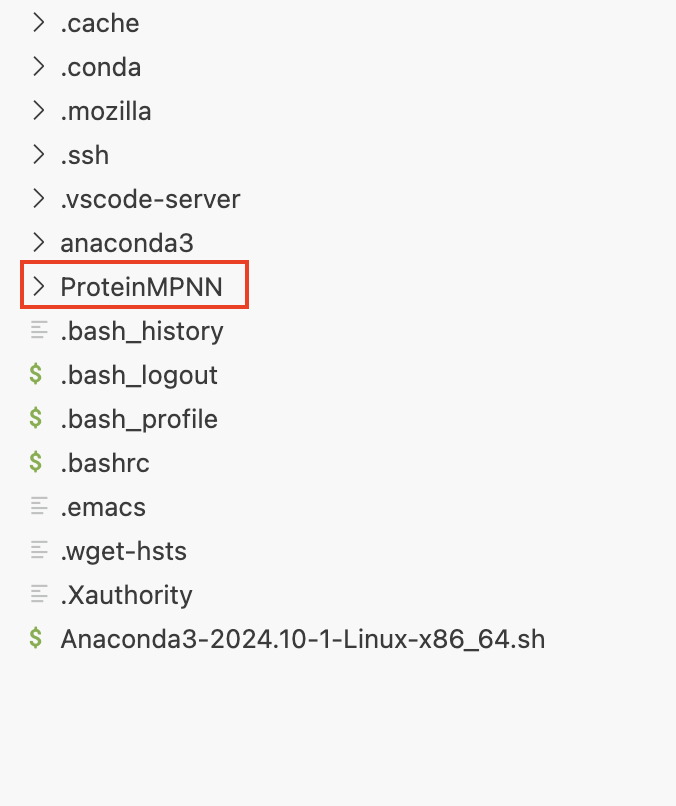
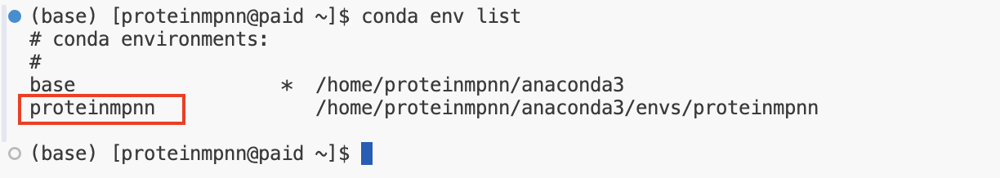
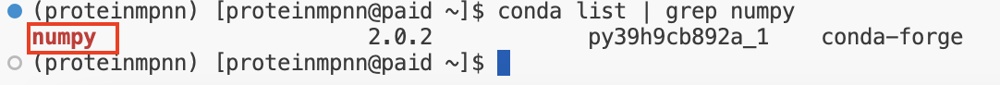
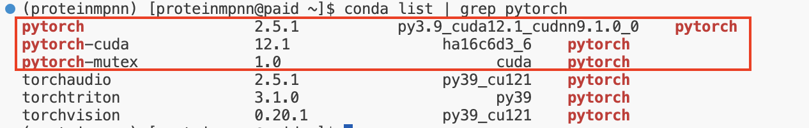
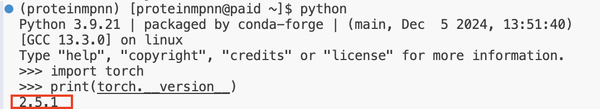

# ProteinMPNN Installation Guide

ProteinMPNN은 David Baker Lab에서 개발된 단백질 작용기를 디자인하기위한 알고리즘입니다.

David Baker Lab에서 개발된 단백질 백본 디자인 알고리즘은 RFdiffusion을 통해 디자인된 **단백질 백본**정보를 활용하여 **단백질 작용기**를 디자인합니다.

ProteinMPNN 역시 GPU를 활용하기 때문에 Cuda, Python, Pytorch 를 필요로합니다.

여기서는 다음과 같은 CUDA, Pytorch 버전을 만족하는 RFdiffusion을 설치하여 사용합니다.

## Anaconda 설치
### 1. 아래 링크를 통해 아나콘다 다운로드 페이지로 이동

> 링크 : [Anaconda Homepage Link](https://www.anaconda.com/download/success)

### 2. Linux에서 64-Bit (X86) Installer 의 링크 복사

### 3. 아래 코드를 이용하여 2번에서 복사한 다운로드 링크를 이용하여 아나콘다 설치파일을 다운로드

> CODE: **`wget https://repo.anaconda.com/archive/Anaconda3-2024.06-1-Linux-x86_64.sh`**

위 코드는 예시이며, **`https://repo.anaconda.com/archive/Anaconda3-2024.06-1-Linux-x86_64.sh`** 부분에 2번에서 복사한 다운로드 링크를 붙여넣기로 입력합니다.

### 4. 아래 코드를 이용해서 3번에서 다운받은 아나콘다 설치 파일을 실행하여 아나콘다 설치

> CODE: **`sh Anaconda3-2024.06-1-Linux-x86_64.sh`**

위 코드는 예시이며, **`Anaconda3-2024.06-1-Linux-x86_64.sh`** 에 3번을 통해 다운받은 설치파일(sh 파일)을 입력합니다.

설치가 완료되면 다음과 같이 `anaconda3` 이라는 폴더가 생성됩니다.

### 5. 아래 코드를 이용해서 설치된 아나콘다 환경을 적용시켜줍니다.

> CODE: **`source ~/.bashrc`**

아나콘다 환경이 적용되면 아래 그림과 같이 CODE 줄 좌측의 계정명 앞에 `(base)`라는 표시가 새롭게 추가됩니다.

## ProteinMPNN 위한 가상환경 셋팅

### ProteinMPNN Github 공식 링크: [ProteinMPNN Github Link](https://github.com/dauparas/ProteinMPNN)

### 1. ProteinMPNN Github Repository(저장공간) 복제
> CODE : **`git clone https://github.com/dauparas/ProteinMPNN.git`**

위 코드를 통해 ProteinMPNN의 Github Repository를 복제하면, 아래 그림과 같이 `ProteinMPNN` 이라는 폴더가 생성됩니다.

### 2. Conda 가상환경 생성

> CODE: **`conda create -n proteinmpnn python=3.9`** 

위 코드를 통해 `proteinmpnn` 라는 Conda 가상환경을 생성과 동시에 python 3.9 버전을 설치합니다. 이때 생성할 가상환경의 이름이 반드시 `proteinmpnn` 일 필요는 없습니다. 자유롭게 설정하셔도 됩니다.

> CODE: **`conda env list`**  

위 코드를 통해 아래 그림과 같이 `proteinmpnn`라는 가상환경이 목록에 추가되어 있는 것을 확인할 수 있습니다.

### 3. 생성한 Conda 가상환경 실행 및 ProteinMPNN 위한 사용 패키지 설치

> CODE: **`conda activate proteinmpnn`**  
> CODE: **`conda install numpy`**

위 코드를 통해 앞서 생성한 `proteinmpnn`이라는 이름의 가상환경을 실행해주고, `numpy` 패키지를 설치해 줍니다.

> CODE: **`conda list | grep numpy`**  

위 코드를 통해 아래 그림과 같이 `numpy`가 정상적으로 설치되었는지 확인할 수 있습니다.

그리고 `proteinmpnn`은 `Pytorch`를 기반으로 작동하기 때문에,  `Pytorch` 설치를 필요로 한다.

앞서 `CUDA 12.1` 버전을 사용하기로 했기 때문에, 아래 그림과 같이 `운영체제`, `설치 패키지 환경`, `프로그래밍 언어`, `CUDA 버전` 등 환경에 맞는 조건을 선택해준 후 `Pytorch` 설치 코드를 확인합니다.

> CODE: **`conda install pytorch torchvision torchaudio pytorch-cuda=12.1 -c pytorch -c nvidia`**  

위 코드는 앞서 확인한 `PyTorch` 설치 코드이며, 해당 코드를 실행하여 설치해줍니다.

> CODE: **`conda list | grep pytorch`**  

설치를 마치게되면 위 코드를 이용하면 아래와 같이 정상적으로 설치되었는지 설치된 패키지 목록에서 확인할 수 있습니다.

> CODE: **`python`**  
> CODE: **`import torch`**  
> CODE: **`print(torch.__version__)`**  

위 코드는 설치한 `PyTorch`의 버전을 확인하기 위한 코드입니다.

 
 
 

# ___ END
